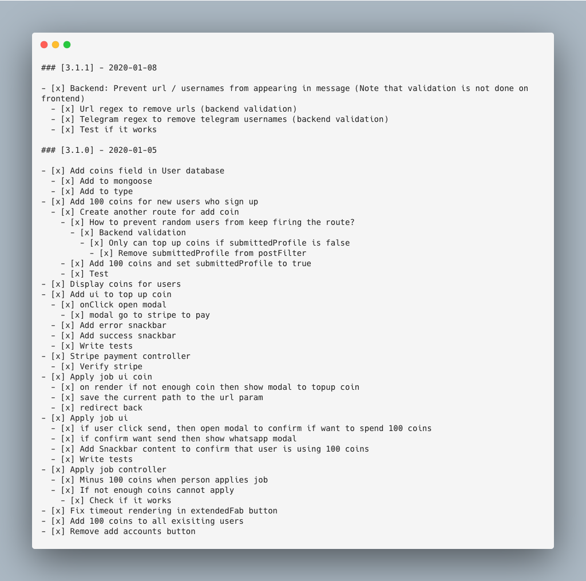

# How to run your personal project? 🤔

---

## Disclaimers

<div style="display: flex; justify-content: center;">
<div style="width: 800px;">
<ul>
<li>This talk is technically non-technical 😾 (I actually wanted to talk about <a href="http://www.larsberg.net/#/dongles">three.js</a>)</li>
<li>The content is very biased and inaccurate 🙀</li>
</ul>
</div>
</div>

---

Based on my 2 years personal experience running this very boring platform called Astar Tutors

---

## Astar Tutors

<div style="display: flex; justify-content: center;">
<div style="width: 800px;">
<ul>
<li>A tution platform that helps tutors find tuition jobs</li>
<li>Around 6000 users now 🐶</li>
</ul>
</div>
</div>

---

# There are x slides

---

## 1. Find a problem with your life


<div style="display: flex; justify-content: center;">
<div style="width: 800px;">
<ul>
<li>Easier to solve</li>
<li>Not an imaginary problem</li>
</ul>
</div>
</div>

---

## 2. Build a MVP

<div style="display: flex; justify-content: center;">
<div style="width: 800px;">
<ul>
<li>Should not take more than a weekend ⏱</li>
<li>Be creative about it 🧢</li>
</ul>
</div>
</div>

---

```
if fail:
    goto 1
```

---

## 3. Observe patterns

<div style="display: flex; justify-content: center;">
<div style="width: 800px;">
<ul>
<li>See how users use your app</li>
<li>Conduct user interviews</li>
</ul>
</div>
</div>

---

## 4. How can I monetize?

---

## 5. Build the stepping stones

---

## 6. Try monetize

<div style="display: flex; justify-content: center;">
<div style="width: 800px;">
<ul>
<li>Test early as possible</li>
</ul>
</div>
</div>

---

```
if fail:
    goto 3
```

---

# General tips

---

## 1. Checklist-driven development

---

</img>

---

## 2. Pick the lowest cost framework / language

<div style="display: flex; justify-content: center;">
<div style="width: 800px;">
<ul>
<li>You probably don't need to worry about scalability</li>
</ul>
</div>
</div>

---

## 3. Ask your friends for help

<div style="display: flex; justify-content: center;">
<div style="width: 800px;">
<ul>
<li>User interviews</li>
<li>User testing</li>
<li>Sanity check</li>
<li>Technical help</li>
</ul>
</div>
</div>

---

## 4. Grow more balls

---

# That's it!

---

# Questions / Advice?